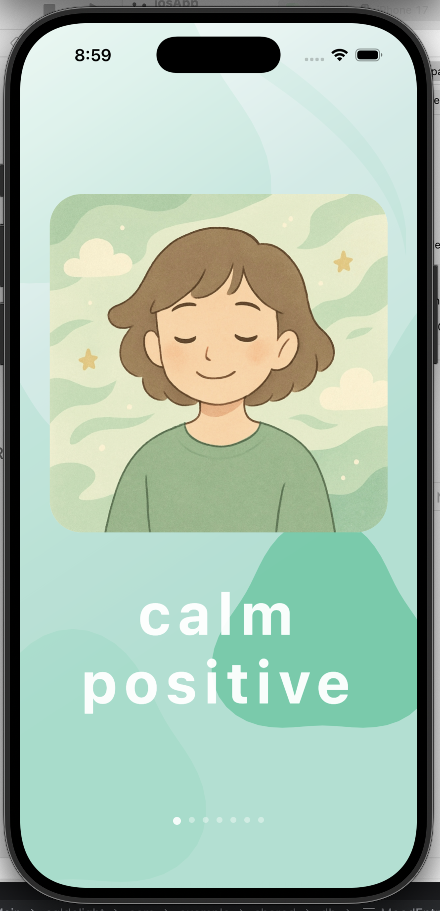
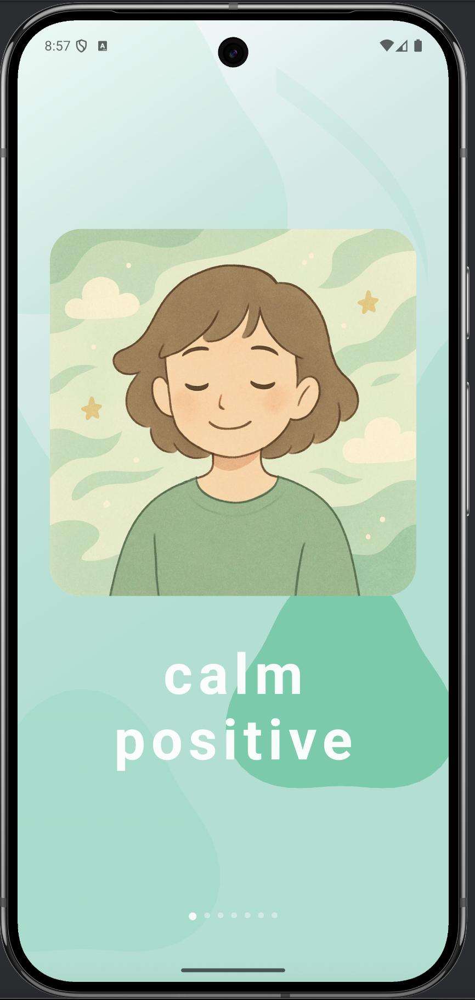
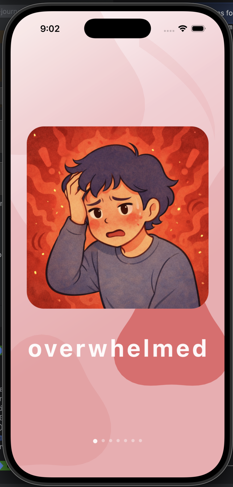
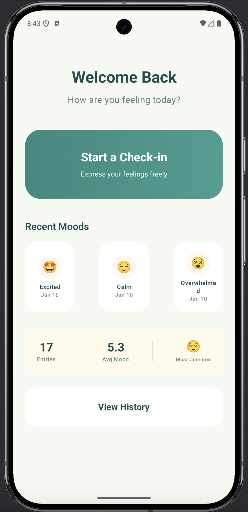
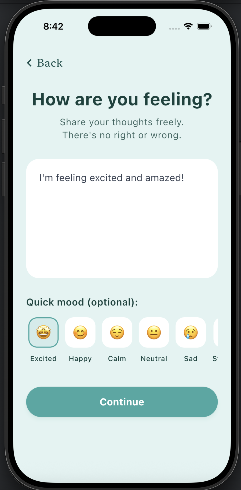
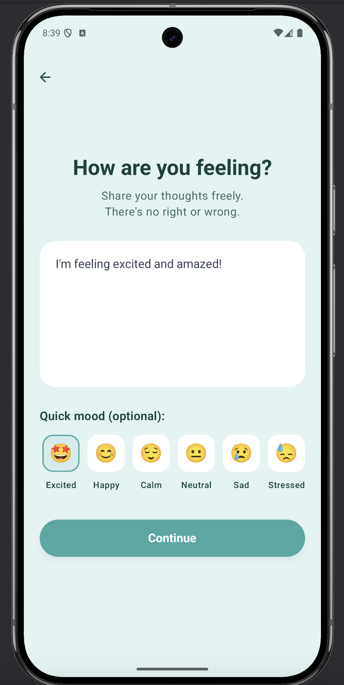
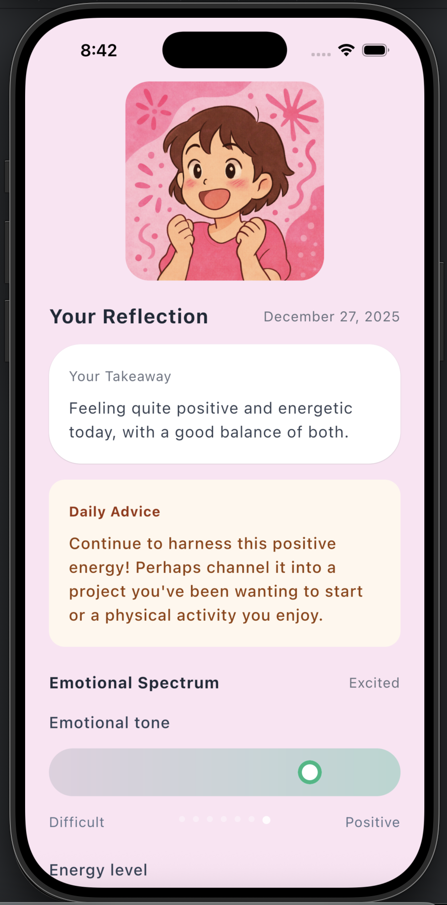
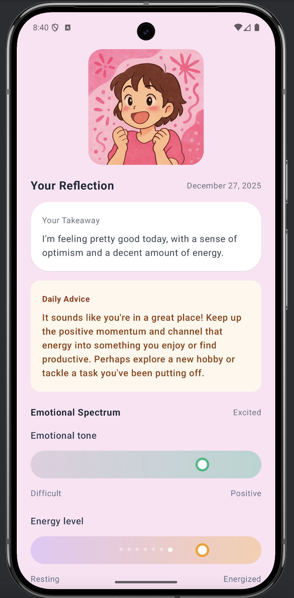
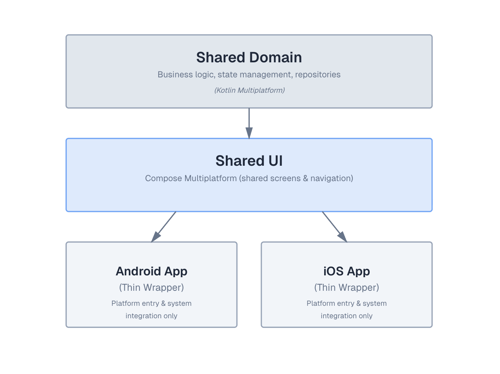

# Eunora - An adaptive mood reflection app

[](https://kotlinlang.org)
[](https://www.jetbrains.com/lp/compose-multiplatform/)
[](LICENSE)
[](https://kotlinconf.com/contest/)

<p align="center">
  
</p>

Eunora is a mood reflection app where the experience adapts to emotional intensity, not just emotional labels.

The app is built with Kotlin Multiplatform, sharing core logic and UI across Android and iOS.


## Table of Contents
- [Demo](#demo)
- [Screenshots](#screenshots)
- [Problem Statement](#problem-statement)
- [Core Idea](#core-idea)
- [Why This Is Different](#why-this-is-different)
- [User Flow Overview](#user-flow-overview)
- [System Architecture](#system-architecture)
- [Tech Stack](#tech-stack)
- [Repository Structure](#repository-structure)
- [How to Run](#how-to-run)
- [Kotlin Coding Conventions](#kotlin-coding-conventions)
- [Future Roadmap](#future-roadmap)
- [License](#license)


## Demo

A short walkthrough demonstrating Eunora’s adaptive emotional flow across different mood inputs.

▶️ Watch the demo video:  
https://www.youtube.com/watch?v=_78pzntFU9I&t=19s


## Screenshots

### Adaptive Flow Examples

| Adaptive Flow | iOS | Android |
|--------------|-----|---------|
| Positive / Calm mood |  |  |
| Intense / Overwhelmed mood |  |  |

---

### Core Experience Screens

| Screen | iOS | Android |
|------|-----|---------|
| Home & Mood Patterns |  |  |
| Mood Input |  |  |
| Reflection Summary |  |  |


## Problem Statement

Most mood tracking apps focus on recording emotions, but treat all moods the same after they are logged.

In reality, different emotional states require different kinds of support: from slowing down intense reactions, to resting during low-energy moments, or preserving positive experiences.

Without emotional context, mood tracking remains passive and limited.


## Core Idea

Eunora adapts its experience based on both **emotional type and activation level**.

Instead of a single static flow, the app responds differently depending on how the user feels:

-   **Positive emotions** → preserve and reflect
    
-   **High-activation emotions** → pause and slow down
    
-   **Low-energy emotions** → rest or continue gently
    
-   **Neutral states** → minimal, uninterrupted flow
    

This adaptation is supported by gentle guidance, personal reflection, emotion-consistent visuals, and long-term emotional patterns.


## Why This Is Different

Most mood trackers focus on *what* is logged.  
Eunora focuses on *how interaction happens*.

By adapting pacing, tone, and flow to emotional state, Eunora becomes an emotionally responsive system, not just a mood log.

## User Flow Overview

**High-level flow (experience sequence)**

-   **Welcome & emotional context**  
    Users begin on a calm overview showing recent moods and patterns, providing emotional continuity before starting a new entry.
    
-   **Mood input**  
    Users express how they feel through free writing or a quick mood selection, without pressure to be precise or analytical.
    
-   **Emotional reflection sequence**  
    After submission, Eunora reflects the moment through a progressive sequence:
    
    -   mood vibe & quick overview
        
    -   mood explanation
        
    -   emotional spectrum
        
    -   personal reflection
        
    -   gentle guidance
        
    -   overall summary
        
-   **History & recall**  
    Each entry is saved as a complete emotional moment and can be revisited from history at any time.

## System Architecture

The project follows a **Kotlin Multiplatform (KMP)** architecture, maximizing code sharing between Android and iOS while maintaining platform-native integration where necessary.

### High-level Architecture




The codebase is structured into three main layers:

-   **Shared Domain (`shared`)**: Contains the core business logic, domain models, data repositories, and ViewModels. This layer is platform-agnostic (pure Kotlin) and drives the application state.
-   **Shared UI (`composeApp`)**: Implements the user interface using **Compose Multiplatform**. This allows for a single declarative UI definition that renders natively on both Android and iOS.
-   **Platform Specific**:
    -   **Android App**: A thin wrapper around the shared Compose App.
    -   **iOS App**: A thin wrapper that hosts the shared Compose View Controller.

### Kotlin Multiplatform Usage

-   **Shared Business Logic**: All application logic, including data fetching, AI analysis models, and local data persistence, resides in the `shared` module.
-   **Shared State Management**: The app uses `StateFlow` for reactive state management. `ViewModel` classes (e.g., `WelcomeViewModel`) in the `shared` module expose UI state to the Compose UI.
-   **ViewModel**: ViewModels are shared components located in the `shared` module, managing pure business logic and state, decoupled from the Android-specific ViewModel implementation where possible, or using multiplatform equivalents.
-   **Shared Compose UI**: The entire screen hierarchy and navigation are implemented in `composeApp/src/commonMain/kotlin` using Jetpack Compose, ensuring a consistent experience across platforms.

## Tech Stack

-   **Language**: [Kotlin](https://kotlinlang.org/) (Multiplatform)
-   **UI Framework**: [Compose Multiplatform](https://www.jetbrains.com/lp/compose-multiplatform/) (Share UI between Android & iOS)
-   **Architecture**: MVVM (Model-View-ViewModel) with Clean Architecture principles
-   **State Management**: [Kotlin Flows](https://kotlinlang.org/api/kotlinx.coroutines/kotlinx-coroutines-core/kotlinx.coroutines.flow/) (StateFlow)
-   **Database**: [SQLDelight](https://cashapp.github.io/sqldelight/) (Type-safe database operations)
-   **Asynchronous Processing**: [Kotlin Coroutines](https://github.com/Kotlin/kotlinx.coroutines)
-   **Lifecycle**: [Jetpack Lifecycle](https://developer.android.com/jetpack/androidx/releases/lifecycle) (ViewModel, Lifecycle-runtime)
-   **AI Integration**: Third-party AI services [(Gemini 2.5 Flash Lite)](https://docs.cloud.google.com/vertex-ai/generative-ai/docs/models/gemini/2-5-flash-lite) used for emotion interpretation and reflective guidance, with a fallback demo mode when AI is unavailable

### Platforms Supported
-   **Android**: Min SDK 24, Target SDK 36
-   **iOS**: Via Kotlin Native & Compose Multiplatform (UIKit)

## Repository Structure

```text
├── composeApp/                # Shared Compose UI & Android Application
│   ├── src/
│   │   ├── androidMain/       # Android entry point & platform specific UI
│   │   ├── commonMain/        # Shared Compose UI code (Screens, Components)
│   │   └── iosMain/           # iOS specific UI bindings
├── shared/                    # Shared Business Logic (Kotlin Multiplatform)
│   ├── src/
│   │   ├── androidMain/       # Android specific implementation (Drivers, etc.)
│   │   ├── commonMain/        # Core Logic: AI, Database, Models, ViewModels, Repositories
│   │   └── iosMain/           # iOS specific implementation
├── iosApp/                    # Native iOS Application (Xcode Project)
├── gradle/                    # Build configuration & version catalogs
└── README.md                  # Project documentation
```

## How to Run

> This project is intended to be run using Android Studio (Android) and Xcode (iOS).

### Prerequisites

-   **JDK 17** or higher
-   **Android Studio** (latest stable) for Android development
-   **Xcode 15+** (macOS only) for iOS development
-   **Gemini API Key** (required for AI features)

---

### 1. Setup & Configuration

**Step 1: Clone the Repository**
```bash
git clone https://github.com/datpham0412/eunora.git
```
**Step 2: Get a Gemini API Key**
1.  Generate a key at [Google AI Studio](https://aistudio.google.com/).
2.  Create a `.env` file at the project root:
    ```env
    GEMINI_API_KEY=your_api_key_here
    ```
    > ⚠️ The API key is required to enable AI-powered emotion analysis.
Without it, the app will still run, but AI features will be disabled.

    > **Note**: The `ApiConfig` file is generated at build time. If you have added your key to `.env` but the app still doesn't recognize it, please try cleaning the project (Build -> Clean Project) and running it again to regenerate the configuration.

---

### 2. Run on Android

1.  Open the project in **Android Studio**.
2.  Allow Gradle to sync.
3.  Select the **composeApp** run configuration and click **Run** ▶️.

---

### 3. Run on iOS

Running on iOS requires generating the shared Compose framework first.
> ⚠️ This is required because the shared Compose UI is packaged as an XCFramework for iOS.

**Step 1: Generate Framework**
Run the following Gradle command from the project root:
```bash
./gradlew :composeApp:assembleComposeAppReleaseXCFramework --no-configuration-cache
```

**Step 2: Configure Xcode**
1.  Open `eunora/iosApp/iosApp.xcodeproj` in Xcode.
2.  **Embed Framework**: In the **General** tab for the `iosApp` target, add the generated framework to **Frameworks, Libraries, and Embedded Content** with "Embed & Sign":
    `composeApp/build/XCFrameworks/release/composeApp.xcframework`
3.  **Link SQLite**: In **Build Settings** -> **Other Linker Flags**, add `-lsqlite3`.

**Step 3: Run**
Select a simulator or connected device and click **Run** ▶️.

> **Note**: You must regenerate the XCFramework (`./gradlew ...`) whenever you modify code in the shared `composeApp` module.

## Kotlin Coding Conventions

The codebase follows Kotlin’s official coding conventions, using consistent naming and a clear, modular structure across shared and platform-specific code.

## Future Roadmap

- **Advanced AI Orchestration**: Migrate the AI orchestration layer to [**JetBrains Koog**](https://docs.koog.ai/) to support more complex emotional agents and long-term memory compression.
- **Wearable Integration**: Companion app for WearOS and watchOS for quick mood logging.


## License

This project is licensed under the MIT License - see the [LICENSE](LICENSE) file for details.

---
This project was created for the Kotlin Multiplatform Contest 2025–2026.
